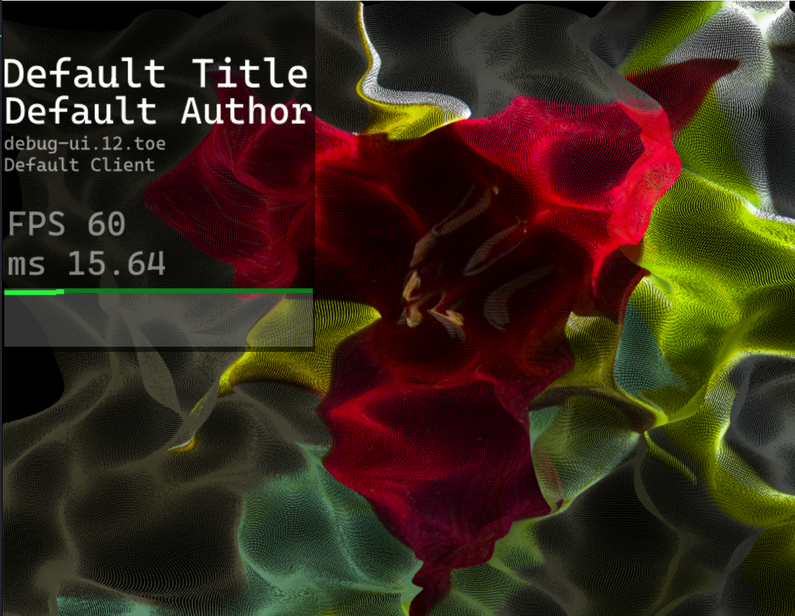

# Touch Performance Debug UI
This is a TouchDesigner tool used to display performance (FPS) of an application while in performance mode. It is a container UI elemenet that can be toggled on and of to provide the FPS and project information



## Install
To install drag in the tox file from the release folder.

## Usage
To toggle the UI type:
```
ctrl + alt + d
```

### Copy
Copy can be edited in the `Config` page.

### Scaling
When enabled the UI will show in the top left corner of the performance screen. To adjust the sizing of the window control the the vertical and horizontal anchors in the `Layout` tab and crontrol the ratio of the text with the slider `Config/Text scale`