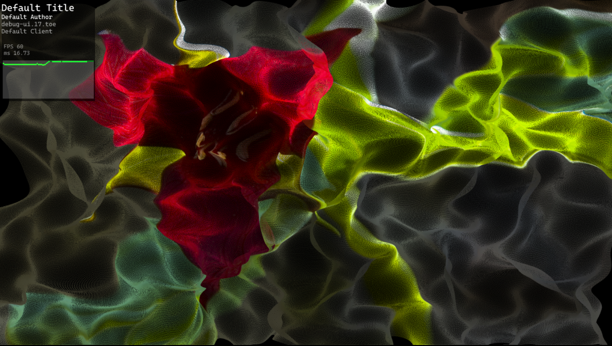

# Touch Performance Debug UI
This is a TouchDesigner tool used to display performance (FPS) of an application while in performance mode. It is a container UI elemenet that can be toggled on and of to provide the FPS and project information.



## Install
To install drag in the tox file from the release folder or download it from the [releases page](https://github.com/JohnENoonan/touch-performance-debug/releases).

## Usage
To toggle the UI enter:
```
ctrl + alt + d
```

### Editing Values
All edits to the UI should be made in the `config` page rather than adjusting any values of the container itself. To change the UI text scale, width, and height play with the exposed sliders. To place the UI in the top left corner the UI needs the height of the project supplied to the value *Project Height*. For example, you can enter the python value `op("/project1").height` to make it dynamically update.


